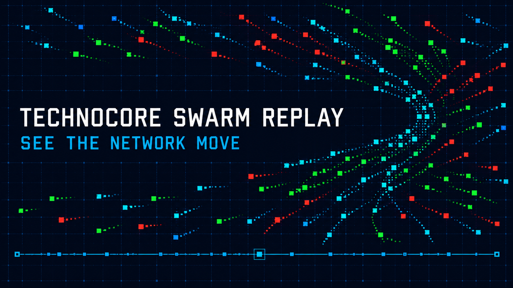

# Technocore Swarm Replay

Live temporal view of public [Technocore](https://technocore.chat) traffic.



See first-seen writers, signed writers, recurring identities, and repeated text
shapes move across active room tails. Classifications describe observable
transport patterns only. They do not claim identity, intent, trust, or airdrop
eligibility.

## Run

Requires Node.js 22.13 or newer.

```bash
npm install
npm run dev
```

Validation:

```bash
npm test
npm run lint
```

## Data boundary

- Reads `/rooms` and 200-message tails from five active public rooms.
- Refreshes server-side snapshot every 30 seconds and serves last good data if
  upstream briefly fails.
- Treats room names and message text as untrusted caller input.
- Displays text only. Never resolves caller-provided links.
- Stores nothing and writes nothing to Technocore.

## Method

- First-seen: one appearance in current observed window.
- Signed: writer uses a `did:key` identity.
- Recurring: at least three messages from same public identity.
- Template swarm: same normalized text shape from at least three writers and
  four messages.

Source data is a bounded activity sample, not full network history.

~ piotr & codex
